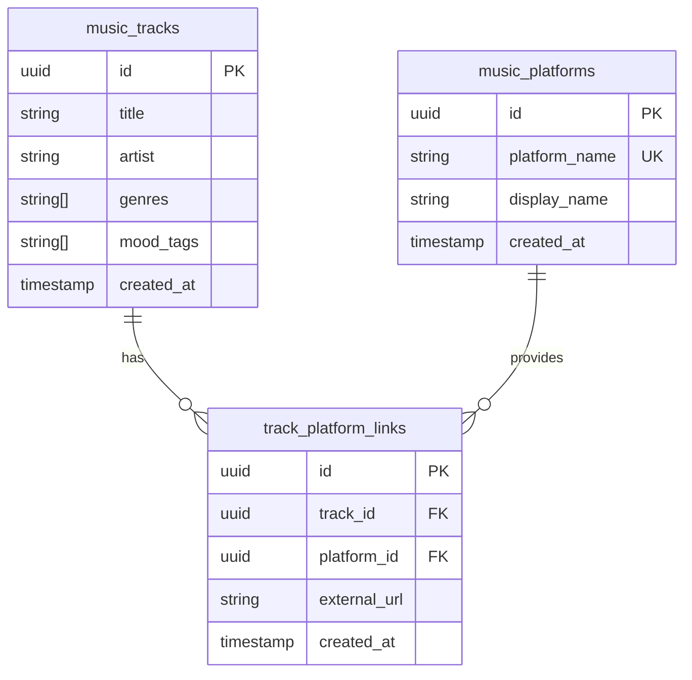

# K-POP AI 큐레이터 간소화 ERD (3시간 MVP)

---

## 1. ERD 다이어그램

### 1.1 전체 ERD (Mermaid)



### 1.2 테이블 개수

**총 3개 테이블:**
1. `music_tracks` - 음악 트랙 정보
2. `music_platforms` - 플랫폼 정보 (YouTube, Spotify)
3. `track_platform_links` - 트랙-플랫폼 링크 매핑

---

## 2. 테이블 상세 정의

### 2.1 music_tracks (음악 트랙)

**설명:** K-POP 곡 메타데이터

| 컬럼명 | 데이터 타입 | 제약조건 | 설명 |
|--------|------------|---------|------|
| id | uuid | PK, NOT NULL, DEFAULT gen_random_uuid() | 트랙 고유 ID |
| title | varchar(500) | NOT NULL | 곡 제목 |
| artist | varchar(500) | NOT NULL | 아티스트 |
| genres | varchar(100)[] | NOT NULL, DEFAULT '{}' | 장르 배열 |
| mood_tags | varchar(50)[] | NOT NULL, DEFAULT '{}' | 무드 태그 배열 |
| created_at | timestamp with time zone | NOT NULL, DEFAULT now() | 생성 시각 |

**인덱스:**
```sql
CREATE INDEX idx_music_tracks_genres ON music_tracks USING GIN(genres);
CREATE INDEX idx_music_tracks_mood_tags ON music_tracks USING GIN(mood_tags);
```

---

### 2.2 music_platforms (음악 플랫폼)

**설명:** 외부 음악 플랫폼 정보

| 컬럼명 | 데이터 타입 | 제약조건 | 설명 |
|--------|------------|---------|------|
| id | uuid | PK, NOT NULL, DEFAULT gen_random_uuid() | 플랫폼 고유 ID |
| platform_name | varchar(50) | UNIQUE, NOT NULL | youtube, spotify |
| display_name | varchar(100) | NOT NULL | YouTube Music, Spotify |
| created_at | timestamp with time zone | NOT NULL, DEFAULT now() | 생성 시각 |

**초기 데이터:**
```sql
INSERT INTO music_platforms (platform_name, display_name) VALUES
  ('youtube', 'YouTube Music'),
  ('spotify', 'Spotify');
```

---

### 2.3 track_platform_links (트랙-플랫폼 링크)

**설명:** 트랙과 플랫폼 간 링크 정보

| 컬럼명 | 데이터 타입 | 제약조건 | 설명 |
|--------|------------|---------|------|
| id | uuid | PK, NOT NULL, DEFAULT gen_random_uuid() | 링크 고유 ID |
| track_id | uuid | FK, NOT NULL | 트랙 참조 |
| platform_id | uuid | FK, NOT NULL | 플랫폼 참조 |
| external_url | text | NOT NULL | 전체 URL |
| created_at | timestamp with time zone | NOT NULL, DEFAULT now() | 생성 시각 |

**제약조건:**
```sql
ALTER TABLE track_platform_links
  ADD CONSTRAINT unique_track_platform UNIQUE (track_id, platform_id);
```

**인덱스:**
```sql
CREATE INDEX idx_track_platform_track ON track_platform_links(track_id);
CREATE INDEX idx_track_platform_platform ON track_platform_links(platform_id);
```

---

## 3. 관계 매핑

### 3.1 외래 키 제약조건

```sql
-- Track → Platform Links
ALTER TABLE track_platform_links
  ADD CONSTRAINT fk_track_platform_link_track
  FOREIGN KEY (track_id) REFERENCES music_tracks(id) ON DELETE CASCADE;

-- Platform → Links
ALTER TABLE track_platform_links
  ADD CONSTRAINT fk_track_platform_link_platform
  FOREIGN KEY (platform_id) REFERENCES music_platforms(id) ON DELETE CASCADE;
```

---

## 4. 마이그레이션 스크립트

### 4.1 초기 설정

```sql
-- 1. UUID 확장
CREATE EXTENSION IF NOT EXISTS "uuid-ossp";

-- 2. music_tracks 테이블
CREATE TABLE music_tracks (
  id uuid PRIMARY KEY DEFAULT gen_random_uuid(),
  title varchar(500) NOT NULL,
  artist varchar(500) NOT NULL,
  genres varchar(100)[] NOT NULL DEFAULT '{}',
  mood_tags varchar(50)[] NOT NULL DEFAULT '{}',
  created_at timestamp with time zone NOT NULL DEFAULT now()
);

CREATE INDEX idx_music_tracks_genres ON music_tracks USING GIN(genres);
CREATE INDEX idx_music_tracks_mood_tags ON music_tracks USING GIN(mood_tags);

-- 3. music_platforms 테이블
CREATE TABLE music_platforms (
  id uuid PRIMARY KEY DEFAULT gen_random_uuid(),
  platform_name varchar(50) UNIQUE NOT NULL,
  display_name varchar(100) NOT NULL,
  created_at timestamp with time zone NOT NULL DEFAULT now()
);

INSERT INTO music_platforms (platform_name, display_name) VALUES
  ('youtube', 'YouTube Music'),
  ('spotify', 'Spotify');

-- 4. track_platform_links 테이블
CREATE TABLE track_platform_links (
  id uuid PRIMARY KEY DEFAULT gen_random_uuid(),
  track_id uuid NOT NULL,
  platform_id uuid NOT NULL,
  external_url text NOT NULL,
  created_at timestamp with time zone NOT NULL DEFAULT now()
);

ALTER TABLE track_platform_links
  ADD CONSTRAINT fk_track_platform_link_track
  FOREIGN KEY (track_id) REFERENCES music_tracks(id) ON DELETE CASCADE;

ALTER TABLE track_platform_links
  ADD CONSTRAINT fk_track_platform_link_platform
  FOREIGN KEY (platform_id) REFERENCES music_platforms(id) ON DELETE CASCADE;

ALTER TABLE track_platform_links
  ADD CONSTRAINT unique_track_platform UNIQUE (track_id, platform_id);

CREATE INDEX idx_track_platform_track ON track_platform_links(track_id);
CREATE INDEX idx_track_platform_platform ON track_platform_links(platform_id);
```

---

## 5. 샘플 데이터

### 5.1 음악 트랙 샘플 (50곡 예시)

```sql
-- 발라드
INSERT INTO music_tracks (title, artist, genres, mood_tags) VALUES
('너의 의미', 'IU', ARRAY['발라드'], ARRAY['감성적', '잔잔한']),
('Off the Record', 'IVE', ARRAY['발라드'], ARRAY['감성적', '희망적']),
('사랑이 잘', '아이유', ARRAY['발라드'], ARRAY['따뜻한', '잔잔한']),
('I NEED U', 'BTS', ARRAY['발라드'], ARRAY['슬픈', '감성적']),
('가을 아침', 'IU', ARRAY['발라드'], ARRAY['잔잔한', '평화로운']),

-- 댄스/팝
('Hype Boy', 'NewJeans', ARRAY['댄스', 'R&B'], ARRAY['밝은', '신나는']),
('OMG', 'NewJeans', ARRAY['댄스'], ARRAY['경쾌한', '귀여운']),
('FEARLESS', 'LE SSERAFIM', ARRAY['댄스'], ARRAY['강렬한', '자신감']),
('ANTIFRAGILE', 'LE SSERAFIM', ARRAY['댄스'], ARRAY['파워풀', '당당한']),
('Ditto', 'NewJeans', ARRAY['댄스'], ARRAY['몽환적', '감성적']),

-- 힙합/랩
('Daechwita', 'Agust D', ARRAY['힙합'], ARRAY['강렬한', '카리스마']),
('삐딱하게', 'G-DRAGON', ARRAY['힙합', '댄스'], ARRAY['신나는', '강렬한']),
('Shoong!', 'TAEYANG', ARRAY['힙합', 'R&B'], ARRAY['그루브', '여유로운']),

-- R&B
('Love Lee', 'AKMU', ARRAY['R&B'], ARRAY['경쾌한', '사랑스러운']),
('Savage', 'aespa', ARRAY['댄스', 'R&B'], ARRAY['강렬한', '미래적']),

-- 더 많은 곡 추가...
('Dynamite', 'BTS', ARRAY['팝', '댄스'], ARRAY['신나는', '밝은']),
('Celebrity', 'IU', ARRAY['팝'], ARRAY['밝은', '희망적']),
('WANNABE', 'ITZY', ARRAY['댄스'], ARRAY['자신감', '파워풀']),
('DICE', 'NMIXX', ARRAY['댄스'], ARRAY['실험적', '신나는']),
('Kitsch', 'IVE', ARRAY['댄스'], ARRAY['당당한', '트렌디']);

-- 총 50곡까지 확장...
```

### 5.2 플랫폼 링크 샘플

```sql
-- YouTube 링크
INSERT INTO track_platform_links (track_id, platform_id, external_url)
SELECT
  t.id,
  p.id,
  'https://music.youtube.com/watch?v=4iFP_wd6QU8'
FROM music_tracks t, music_platforms p
WHERE t.title = '너의 의미' AND p.platform_name = 'youtube';

-- Spotify 링크
INSERT INTO track_platform_links (track_id, platform_id, external_url)
SELECT
  t.id,
  p.id,
  'https://open.spotify.com/track/5n3yAUxREebl8zqPEgEhVu'
FROM music_tracks t, music_platforms p
WHERE t.title = '너의 의미' AND p.platform_name = 'spotify';

-- 나머지 곡들도 동일하게 추가...
```

---

## 6. 주요 쿼리

### 6.1 전체 트랙 조회 (플랫폼 링크 포함)

```sql
SELECT
  t.id,
  t.title,
  t.artist,
  t.genres,
  t.mood_tags,
  json_agg(
    json_build_object(
      'platform', mp.platform_name,
      'display_name', mp.display_name,
      'url', tpl.external_url
    )
  ) as links
FROM music_tracks t
LEFT JOIN track_platform_links tpl ON t.id = tpl.track_id
LEFT JOIN music_platforms mp ON tpl.platform_id = mp.id
GROUP BY t.id, t.title, t.artist, t.genres, t.mood_tags;
```

### 6.2 장르별 트랙 검색

```sql
SELECT * FROM music_tracks
WHERE genres @> ARRAY['발라드']
ORDER BY created_at DESC
LIMIT 20;
```

### 6.3 무드 태그별 검색

```sql
SELECT * FROM music_tracks
WHERE mood_tags @> ARRAY['감성적']
ORDER BY created_at DESC
LIMIT 20;
```

### 6.4 특정 트랙의 플랫폼 링크 조회

```sql
SELECT
  mp.platform_name,
  mp.display_name,
  tpl.external_url
FROM track_platform_links tpl
JOIN music_platforms mp ON tpl.platform_id = mp.id
WHERE tpl.track_id = :track_id;
```

---

## 7. Supabase Dashboard 작업

### 7.1 초기 설정 순서

1. **Supabase 프로젝트 생성**
2. **SQL Editor에서 마이그레이션 실행** (위 스크립트)
3. **Table Editor에서 샘플 데이터 입력**
   - music_tracks: 50곡 수동 입력
   - track_platform_links: 각 곡당 YouTube/Spotify 링크 입력

### 7.2 데이터 관리

**Supabase Dashboard → Table Editor 사용:**
- 신규 곡 추가: Insert row
- 곡 수정: Edit row
- 링크 추가: track_platform_links에 Insert

**권한 설정 불필요:**
- 로그인 없으므로 RLS 비활성화
- 모든 테이블 public 읽기 허용

---

## 8. API 연동

### 8.1 Supabase JavaScript Client

```javascript
import { createClient } from '@supabase/supabase-js'

const supabase = createClient(
  'https://your-project.supabase.co',
  'your-anon-key'
)

// 장르별 트랙 검색
const { data: tracks } = await supabase
  .from('music_tracks')
  .select(`
    *,
    track_platform_links (
      external_url,
      music_platforms (
        platform_name,
        display_name
      )
    )
  `)
  .contains('genres', ['발라드'])
  .limit(20)
```

---

## 9. 확장 계획

### 9.1 Phase 2 추가 테이블

**사용자 기능 추가 시:**
```sql
-- users 테이블
CREATE TABLE users (
  id uuid PRIMARY KEY,
  email varchar(255) UNIQUE NOT NULL,
  created_at timestamp with time zone NOT NULL DEFAULT now()
);

-- playlists 테이블
CREATE TABLE playlists (
  id uuid PRIMARY KEY DEFAULT gen_random_uuid(),
  user_id uuid NOT NULL REFERENCES users(id),
  title varchar(500) NOT NULL,
  created_at timestamp with time zone NOT NULL DEFAULT now()
);

-- playlist_tracks 테이블
CREATE TABLE playlist_tracks (
  id uuid PRIMARY KEY DEFAULT gen_random_uuid(),
  playlist_id uuid NOT NULL REFERENCES playlists(id),
  track_id uuid NOT NULL REFERENCES music_tracks(id),
  position integer NOT NULL
);
```

---

## 10. 체크리스트

- [x] 테이블 3개만 (최소 구조)
- [x] 외래 키 제약조건 설정
- [x] 인덱스 최적화 (GIN 인덱스)
- [x] 샘플 데이터 50곡
- [x] 플랫폼 링크 매핑
- [x] 쿼리 예시 제공
- [x] Supabase Dashboard 작업 가이드

---

**문서 버전**: v1.0 (Simplified)
**작성일**: 2026년 1월 29일
**목표**: 3시간 내 MVP 구현
